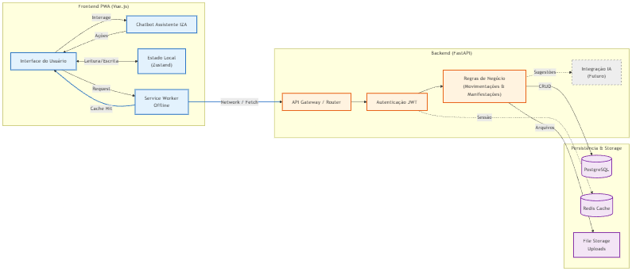
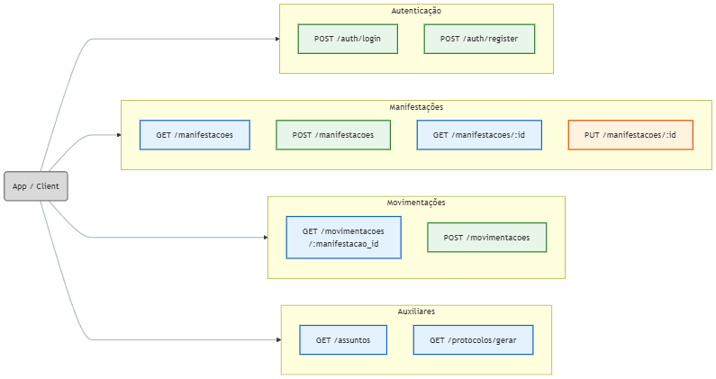
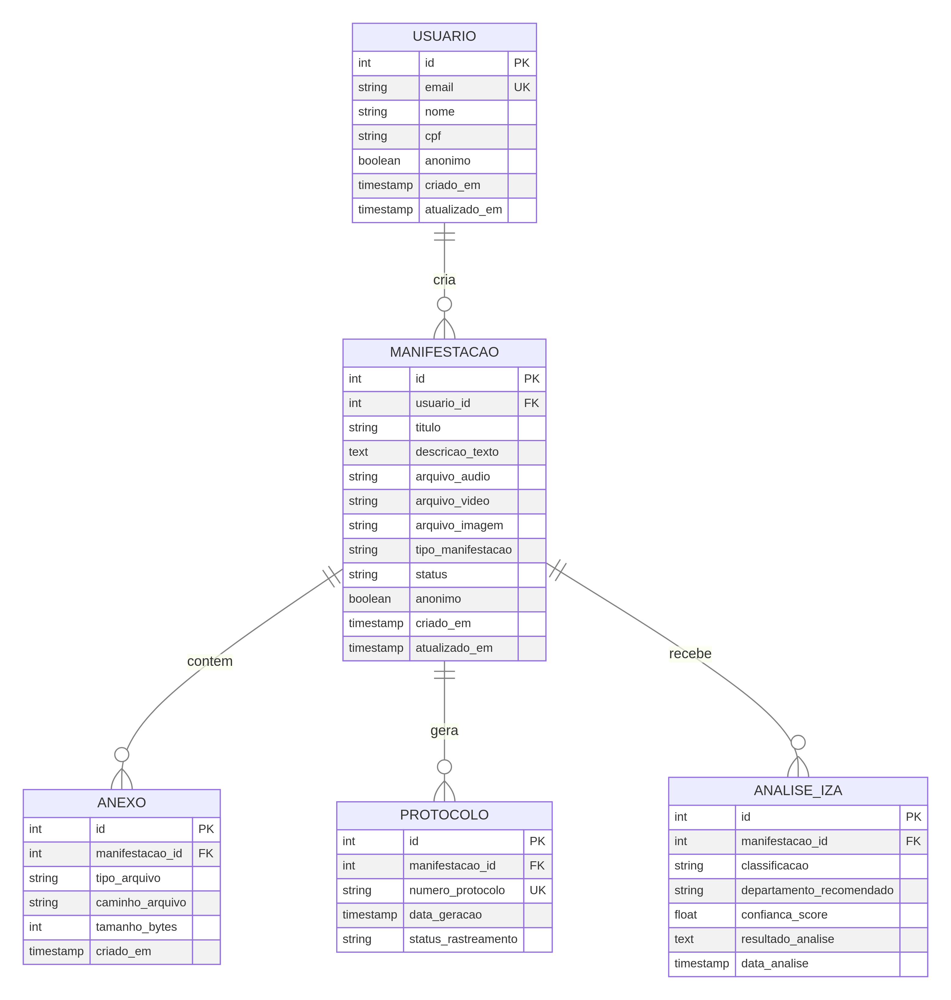
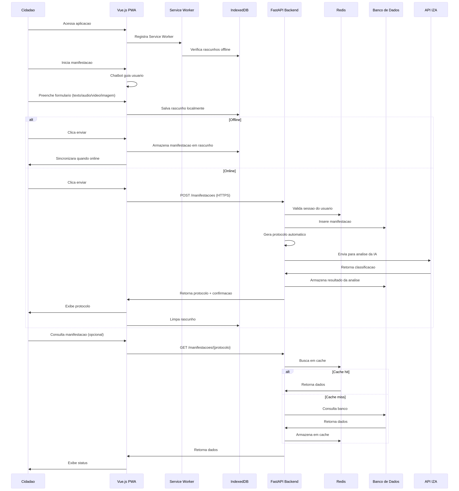

# Especificação Técnica: PWA de Ouvidoria Acessível

#### **Projeto**: `Participa-DF`
#### **Autores**: 
- Rafael da Silva Oliveira -
<a href="https://www.linkedin.com/in/rafael-da-silva-oliveira-623634184/" target="blank">Linkedin</a>

- Wallison Chagas Lucas - <a href="https://www.linkedin.com/in/wallison-lucas-410483239/" target="blank">Linkedin</a>

- Breno Braga Galvão - <a href="https://www.linkedin.com/in/breno-braga-galv%C3%A3o/" target="blank">Linkedin</a>
---

## 1. Introdução e Objetivos

Este documento detalha a especificação técnica para o desenvolvimento de uma solução digital inovadora e acessível para o **Participa DF**, em conformidade com o desafio da categoria **Ouvidoria** do 1º Hackathon em Controle Social. O objetivo é criar um Progressive Web App (PWA) que permita o registro de manifestações por texto, áudio, imagem e vídeo, com foco em acessibilidade, usabilidade e integração com a inteligência artificial IZA da Ouvidoria-Geral do DF.

### 1.1. Requisitos Chave

- **PWA**: A aplicação deve ser instalável, funcionar offline e ser responsiva.
- **Multicanalidade**: Suportar entradas de texto, áudio, vídeo e imagem.
- **Acessibilidade**: Conformidade total com as diretrizes WCAG 2.1 nível AA.
- **Anonimato**: Permitir o registro de manifestações de forma anônima.
- **Protocolo Automático**: Geração e emissão de um número de protocolo para cada manifestação.
- **Integração com IZA**: A solução deve se comunicar com a API da IZA para análise das manifestações.

---

## 2. Arquitetura da Solução

A arquitetura proposta desacopla o frontend do backend, garantindo escalabilidade, manutenibilidade e uma melhor experiência de desenvolvimento. A stack tecnológica foi escolhida para atender aos requisitos de performance, PWA e integração.

- **Frontend**: Vue.js (com Vite, TypeScript, TailwindCSS)
- **Backend**: FastAPI (Python)
- **Cache**: Redis
- **Banco de Dados**: PostgreSQL

### 2.1. Diagrama de Arquitetura Geral

O diagrama abaixo ilustra a interação entre os principais componentes do sistema, desde o usuário até os serviços de backend e a infraestrutura de deploy.

---

## 3. Especificação do Frontend (Vue.js)

O frontend será uma Single Page Application (SPA) construída com Vue.js, transformada em um PWA completo. O foco será em performance, acessibilidade e uma experiência de usuário fluida.

### 3.1. Estrutura de Componentes

A aplicação será modularizada em componentes reutilizáveis, seguindo as melhores práticas do Vue.js.

### 3.2. Estratégia de PWA e Offline-First

- **Service Worker**: Utilizaremos o Workbox para gerenciar o ciclo de vida do Service Worker. Ele será responsável por:
    - **Cache de Assets**: Cachear todos os arquivos estáticos (JS, CSS, fontes) na instalação (`Cache-First`).
    - **Navegação Offline**: Servir uma página de fallback customizada quando o usuário estiver offline e tentar acessar uma rota não cacheada.
    - **Sincronização em Background**: Usar a API `BackgroundSync` para enfileirar manifestações enviadas offline e submetê-las automaticamente quando a conexão for restabelecida.
- **Web App Manifest**: Um arquivo `manifest.json` será configurado para permitir que a aplicação seja instalada na tela inicial do dispositivo, com ícone, nome e tela de splash customizados.
- **IndexedDB**: Para armazenamento de dados no lado do cliente. Será usado para salvar rascunhos de manifestações e os dados de manifestações enviadas em modo offline antes da sincronização.

### 3.3. Estratégia de Acessibilidade (WCAG 2.1 AA)

- **HTML Semântico**: Uso correto de tags como `<main>`, `<nav>`, `<header>`, `<button>` para dar contexto a leitores de tela.
- **ARIA Attributes**: Implementação de roles e atributos ARIA (`aria-label`, `aria-hidden`) para componentes dinâmicos.
- **Contraste de Cores**: O design seguirá a recomendação de contraste mínimo de 4.5:1.
- **Navegação por Teclado**: Todos os elementos interativos serão acessíveis e operáveis via teclado.
- **Testes**: Serão realizados testes contínuos com ferramentas como Lighthouse, axe e testes manuais com leitores de tela (NVDA, VoiceOver).

### 3.4. Chatbot Assistente

- Um componente de chatbot será desenvolvido para guiar o usuário no preenchimento do formulário.
- **Fluxo**: O chatbot fará perguntas sequenciais (`Qual o assunto?`, `Descreva o ocorrido.`) e preencherá os campos do formulário em tempo real.
- **Interação**: O usuário poderá interagir tanto com o chatbot quanto diretamente com o formulário.
- **Inteligência**: O chatbot poderá usar uma LLM (via API do backend) para entender a intenção do usuário e oferecer sugestões.

---

## 4. Especificação do Backend (FastAPI)

O backend será uma API RESTful construída com FastAPI, responsável pela lógica de negócio, persistência de dados e integrações.

### 4.1. Endpoints da API

A API será organizada em rotas lógicas para gerenciar manifestações, protocolos e autenticação (se aplicável).

### 4.2. Processamento de Mídia

- **Upload**: Arquivos de áudio, vídeo e imagem serão recebidos como `UploadFile` no FastAPI.
- **Armazenamento**: Os arquivos serão salvos em um serviço de armazenamento de objetos (como S3 ou similar) e o caminho será referenciado no banco de dados. Para o hackathon, podem ser salvos no sistema de arquivos do servidor de deploy.
- **Validação**: Serão aplicadas validações de tamanho e tipo de arquivo.

### 4.3. Integração com Redis

- **Cache de Sessão**: Se houver login, as sessões de usuário serão armazenadas no Redis para validação rápida.
- **Cache de Dados**: Respostas de API que não mudam com frequência (ex: tipos de manifestação) serão cacheadas para reduzir a carga no banco de dados.

---

## 5. Modelo de Dados e Banco de Dados

O banco de dados relacional (PostgreSQL) armazenará todas as informações de forma estruturada.

### 5.1. Diagrama Entidade-Relacionamento (ER)

O diagrama abaixo descreve as tabelas principais e seus relacionamentos.

---

## 6. Fluxo de Dados

O diagrama de sequência a seguir detalha o fluxo de uma manifestação, desde a criação pelo cidadão até o processamento no backend, incluindo o modo offline.

---

## 7. Estratégia de Deploy

- **Frontend (Vue.js)**: Deploy contínuo em uma plataforma de hospedagem estática (Vercel ou Netlify) a partir do repositório Git.
- **Backend (FastAPI)**: Containerização com Docker e deploy em uma plataforma como serviço (Heroku ou Google Cloud Run).
- **CI/CD**: Configuração de um pipeline simples com GitHub Actions para automatizar os builds e deploys do frontend e backend a cada `push` na branch principal.

---

