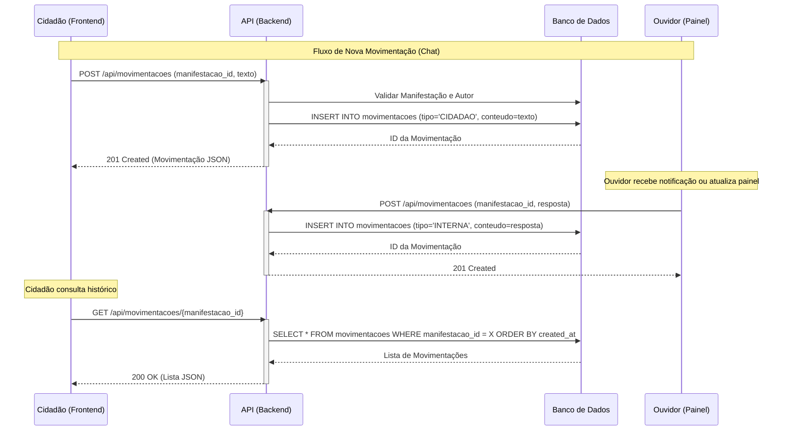

# Análise da Estrutura do Participa DF OUV

## Visão Geral
Este documento detalha a estrutura técnica e funcional do projeto **Participa DF OUV**, uma solução de ouvidoria moderna, acessível e multicanal. O sistema foi projetado para facilitar a interação do cidadão com o governo, garantindo transparência, agilidade e conformidade com as normativas vigentes.

## Fluxo de Formulário (Frontend PWA)

O frontend foi desenvolvido como um **Progressive Web App (PWA)** utilizando Vue.js, garantindo funcionamento offline e instalação em dispositivos móveis.

### Etapas Sequenciais (Wizard):
1.  **Tipo e Assunto**:
    *   Seleção do tipo de manifestação (Texto, Áudio, Vídeo, Imagem).
    *   Escolha do assunto (categoria) com busca dinâmica.
    *   Opção de anonimato (conforme Art. 14 da IN).
2.  **Conteúdo (Multicanal)**:
    *   **Texto**: Campo livre (mínimo 20 caracteres).
    *   **Áudio**: Gravador integrado com visualização de tempo e preview.
    *   **Vídeo/Imagem**: Upload drag-and-drop com validação de formato.
    *   Campos dinâmicos específicos por assunto (ex: Nome do servidor, Órgão, Data/Hora).
3.  **Identificação**:
    *   Se não anônimo: Nome, E-mail, CPF (validação automática).
    *   Se anônimo: Pula esta etapa.
4.  **Revisão e Envio**:
    *   Resumo dos dados preenchidos.
    *   Geração automática de protocolo (OUVIDORIA-YYYYMMDD-XXXXXX).

## Requisitos Legais (Instrução Normativa)

### Classificações de Manifestação (Art. 1):
*   Reclamação
*   Denúncia
*   Elogio
*   Sugestão
*   Informação
*   Solicitação de Serviços

### Regras de Negócio Implementadas:
*   **Anonimato**: Permitido exclusivamente para Reclamações e Denúncias.
*   **Prazos**: Controle automático de SLAs (10 dias preliminar, 20 dias final).
*   **Linguagem Cidadã**: Interface desenhada para clareza e objetividade (Art. 10).

## Modelo de Dados (Backend)

O banco de dados PostgreSQL foi estruturado para suportar flexibilidade e histórico completo.

### Tabela: Assuntos
Define as categorias e os campos dinâmicos de cada formulário.
```
id: Integer PK
nome: String (ex: "Iluminação Pública")
descricao: String
campos_extra: JSON (schema dos campos dinâmicos)
ativo: Boolean
```

### Tabela: Manifestacoes
Armazena o registro principal da solicitação.
```
id: Integer PK
protocolo: String UK
tipo: String (TEXTO, AUDIO, VIDEO, IMAGEM)
descricao: Text
status: String (PENDENTE, EM_ANALISE, CONCLUIDA)
anonimo: Boolean
assunto_id: FK -> Assuntos
usuario_id: FK -> Usuarios (Nullable)
created_at: DateTime
updated_at: DateTime
```

### Tabela: Movimentacoes (Novo)
Registra o histórico de interações (chat) e trâmites internos.
```
id: Integer PK
tipo: String (INTERNA | CIDADAO | SISTEMA)
conteudo: Text (mensagem ou log de ação)
lida: Boolean
manifestacao_id: FK -> Manifestacoes
autor_id: FK -> Usuarios (Nullable)
created_at: DateTime
```

### Tabela: Anexos
Gerencia arquivos de mídia associados.
```
id: Integer PK
nome_arquivo: String
tipo_mime: String
caminho_arquivo: String
manifestacao_id: FK -> Manifestacoes
created_at: DateTime
```

## Endpoints da API (FastAPI)

### Manifestações
*   `GET /api/assuntos` - Listar assuntos ativos.
*   `POST /api/manifestacoes` - Criar nova manifestação (Multipart/Form-Data).
*   `GET /api/manifestacoes/{protocolo}` - Consultar status e detalhes.

### Movimentações (Chat)
*   `GET /api/movimentacoes/{manifestacao_id}` - Obter histórico de mensagens.
*   `POST /api/movimentacoes` - Adicionar nova mensagem (Cidadão ou Ouvidor).

### Autenticação
*   `POST /api/auth/login` - Autenticação JWT.
*   `POST /api/auth/register` - Cadastro de cidadão.

### Diagrama de Sequência: Fluxo de Chat



## Integração com IZA (Chatbot Assistente)

O assistente virtual **IZA** foi integrado ao frontend para:
*   Guiar o cidadão no preenchimento via chat conversacional.
*   Sugerir o assunto mais adequado com base no relato inicial.
*   Tirar dúvidas sobre prazos e procedimentos.
*   Redirecionar automaticamente para as telas corretas do sistema.

## Acessibilidade (WCAG 2.1 AA)

O projeto segue rigorosamente as diretrizes de acessibilidade:
*   **Navegação por Teclado**: Foco visível e ordem lógica (Tab Index).
*   **Leitores de Tela**: Rótulos ARIA em todos os campos e botões.
*   **Alto Contraste**: Modo ativado via menu de acessibilidade.
*   **Zoom de Fonte**: Controle de tamanho de texto sem quebra de layout.
*   **Skip Links**: Atalhos para pular direto ao conteúdo principal.
