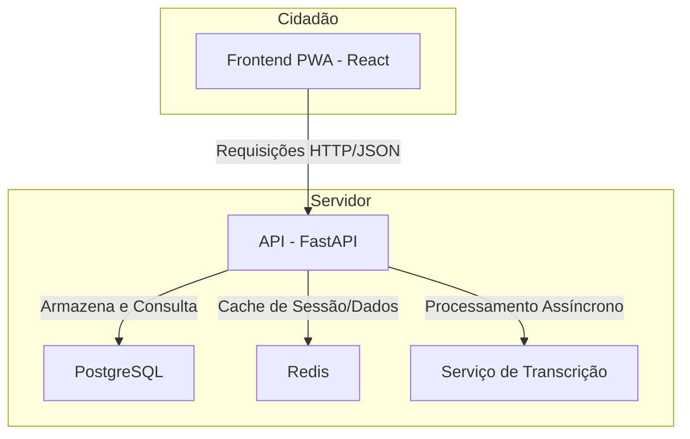

# Análise Técnica e Funcional - Participa DF OUV

## 1. Visão Geral

Este documento detalha a estrutura técnica e funcional do projeto **Participa DF OUV**, uma solução de ouvidoria moderna, acessível e multicanal. O sistema foi projetado para facilitar a interação do cidadão com o governo do Distrito Federal, garantindo transparência, agilidade e conformidade com as normativas vigentes.

O projeto é composto por três componentes principais:

- **Frontend (PWA)**: Uma aplicação web progressiva (PWA) desenvolvida em React, que oferece uma experiência de usuário rica, funcionamento offline e instalação em dispositivos móveis.
- **Backend (API)**: Uma API robusta construída com FastAPI e Python, responsável pela lógica de negócio, gerenciamento de dados e integrações.
- **Infraestrutura**: Orquestração de serviços com Docker Compose, incluindo banco de dados PostgreSQL e cache com Redis.

## 2. Arquitetura da Solução

A arquitetura foi desenhada para ser modular, escalável e de fácil manutenção.

| Componente | Tecnologia | Responsabilidade |
| :--- | :--- | :--- |
| **Frontend** | React (PWA) | Interface do usuário, captura de manifestações, acessibilidade. |
| **Backend** | FastAPI (Python) | Lógica de negócio, endpoints da API, autenticação, orquestração. |
| **Banco de Dados** | PostgreSQL | Armazenamento persistente de manifestações, usuários, etc. |
| **Cache** | Redis | Armazenamento de sessões, cache de consultas frequentes. |
| **Design System** | Neumorfismo Acessível | Garante uma experiência visual coesa e inclusiva. |

Para mais detalhes sobre a identidade visual, consulte o documento **[DESIGN.md](./DESIGN.md)**.

## 3. Fluxo do Usuário (Frontend)

O frontend guia o cidadão através de um formulário sequencial (wizard) para simplificar o registro da manifestação.

1.  **Tipo e Assunto**: Seleção do tipo de manifestação (Texto, Áudio, Vídeo, Imagem) e da categoria (assunto).
2.  **Conteúdo Multicanal**: Interface adaptada para cada tipo de conteúdo, incluindo gravador de áudio e upload de arquivos.
3.  **Identificação**: Opção de registro anônimo (conforme a norma) ou identificado.
4.  **Revisão e Protocolo**: Resumo da manifestação e geração de um número de protocolo para acompanhamento.

## 4. Modelo de Dados (Backend)

O banco de dados PostgreSQL foi estruturado para suportar a complexidade das operações de ouvidoria.

- **`manifestacoes`**: Tabela central que armazena a manifestação principal.
- **`movimentacoes`**: Registra todo o histórico de interações (chat entre cidadão e ouvidor) e trâmites internos.
- **`assuntos`**: Define as categorias de manifestação e permite a criação de campos de formulário dinâmicos em formato JSON.
- **`anexos`**: Gerencia os arquivos de mídia associados a uma manifestação.
- **`usuarios`**: Armazena dados dos cidadãos para manifestações identificadas.

## 5. Endpoints Principais da API

A API, construída com FastAPI, expõe os seguintes endpoints para interação com o frontend:

- `POST /api/manifestacoes`: Cria uma nova manifestação.
- `GET /api/manifestacoes/{protocolo}`: Consulta o status e os detalhes de uma manifestação.
- `GET /api/movimentacoes/{manifestacao_id}`: Obtém o histórico de mensagens (chat) de uma manifestação.
- `POST /api/movimentacoes`: Adiciona uma nova mensagem ao chat da manifestação.
- `GET /api/assuntos`: Lista todas as categorias de assuntos disponíveis.

## 6. Conformidade e Acessibilidade

O projeto adere a importantes diretrizes para garantir a qualidade e a inclusão.

- **Instrução Normativa de Ouvidoria**: As regras de negócio, como prazos de resposta e permissão de anonimato, seguem estritamente a legislação.
- **WCAG 2.1 (Nível AA)**: A interface foi projetada para ser acessível a todos, com suporte a leitores de tela, navegação por teclado, alto contraste e outras funcionalidades assistivas.
- **Linguagem Cidadã**: A comunicação e os textos da interface são claros e objetivos para facilitar o entendimento por todos os cidadãos.
